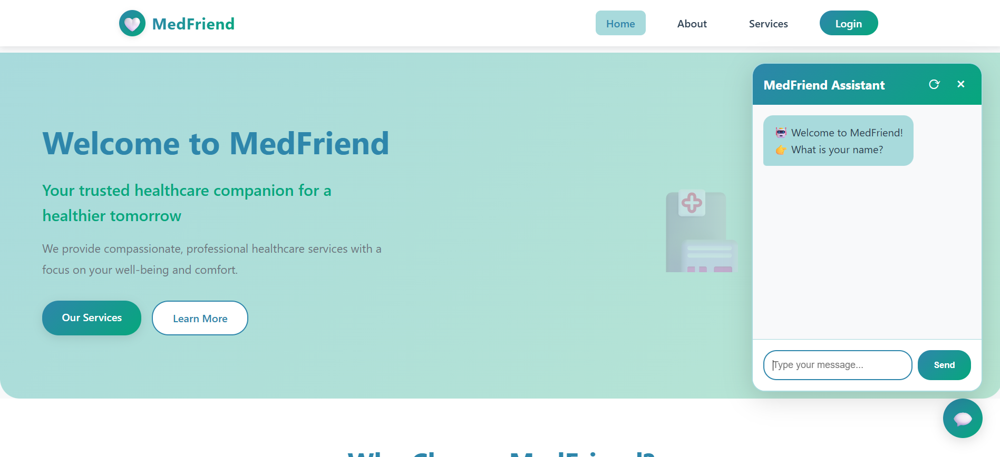

# MedFriend – AI Health Companion 💙

MedFriend is a full-stack healthcare assistant that pairs a machine-learning disease predictor with a conversational experience users can access from any browser. This repository contains the Flask backend, ML pipeline, Clerk-powered authentication, and a responsive landing page.



## ✨ Features

- **Conversational triage** – multi-step dialogue that captures demographics, lifestyle, symptoms, and follow-up answers.
- **ML-driven diagnosis** – Random Forest classifier trained on curated symptom/disease datasets with confidence scores and precautions.
- **NLP helpers** – fuzzy matching and synonym dictionaries to recognize real-world phrasing.
- **Clerk authentication** – modal login and navbar avatar for session management.
- **Responsive UI** – modern hero page, service highlights, chatbot widget, and CTA sections.
- **Dataset utilities** – CSV-based master data for descriptions, severity, and recommended actions.

## 🧱 Project Structure

```
.
├── app.py                 # Flask app, ML pipeline, and API routes
├── Data/                  # Training & testing CSVs
├── MasterData/            # Symptom descriptions, severity, precautions
├── static/
│   ├── styles.css         # Main styling for landing pages
│   ├── script.js          # Chatbot logic + Clerk modal controller
│   └── images/
│       └── bg1.png
├── templates/             # Flask Jinja templates (index, about, services, contact)
├── docs/assets/           # README assets (screenshots, diagrams)
└── README.md
```

## 🚀 Quick Start

1. **Clone + install dependencies**
   ```bash
   git clone <repo-url>
   cd MedFriend
   python -m venv .venv
   .venv\Scripts\activate  # or source .venv/bin/activate
   pip install -r requirements.txt
   ```

2. **Set environment variables**
   ```bash
   set FLASK_APP=app.py
   set FLASK_ENV=development
   set CLERK_PUBLISHABLE_KEY=pk_test_xxx
   ```
   > macOS/Linux: use `export`.

3. **Run the server**
   ```bash
   flask run  # defaults to http://127.0.0.1:5000/
   ```

4. **Open in browser**
   ```
   http://127.0.0.1:5000/
   ```

## 🔐 Authentication (Clerk)

- Login modal is triggered via the “Login” pill in the navbar.
- `static/script.js` handles loading the Clerk SDK, showing the modal, and swapping the navbar user avatar.
- Ensure the publishable key is provided via environment variable or `app.py`.

## 📊 Datasets

- `Data/Training.csv`, `Data/Testing.csv` – model inputs and evaluation slices.
- `MasterData/` – symptom descriptions, severity scores, and preventative steps loaded into dictionaries on boot.

## 🧪 Testing Tips

- Use the floating chatbot button to walk through the guided diagnostic conversation.
- Send `reset` inside the chatbot to restart a session.
- When Clerk is configured, verify the login modal mounts correctly and the navbar avatar replaces the Login CTA.

## 🙌 Contributing

1. Fork & create a feature branch.
2. Make your changes and add tests if applicable.
3. Submit a pull request describing the update and screenshots if UI-related.

## 📜 License

This project is intended for educational purposes. Adapt or extend it to fit your healthcare AI experiments responsibly.

